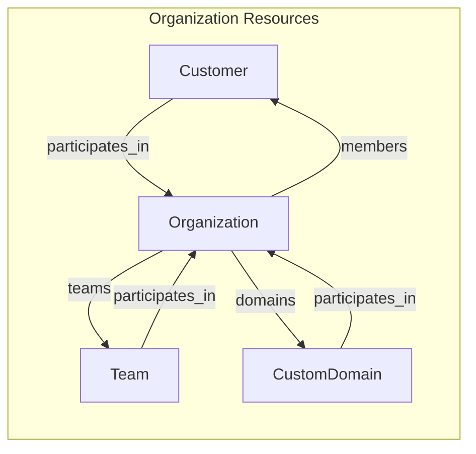

# CustomDomain Organization Ownership

**Last Updated:** 2025-12-21
**Framework:** Familia v2.0.0-pre22 (Redis ORM)
**Related Issue:** #1887

## Overview

CustomDomain uses Familia v2 participations for multi-tenant organization ownership. Organizations own domains (not individual customers), enabling:

- Team members access organization domains via their memberships
- Efficient org-scoped queries with proper indexing
- Bidirectional relationships with auto-generated APIs

## Architecture

### Before (Customer-Based)

```
Customer --custid--> CustomDomain
```

Direct customer ownership via `custid` field with manual relationship management.

### After (Organization-Based)



Organization-based ownership via Familia v2 `participates_in` declarations.

## Familia v2 Implementation

### CustomDomain Model

```ruby
class CustomDomain < Familia::Horreum
  feature :relationships  # Enable Familia v2 features

  field :org_id           # Organization foreign key (replaces custid)

  participates_in :Organization, :domains, score: :created

  unique_index :display_domain, :display_domain_index  # Global uniqueness
end
```

### Organization Model

```ruby
class Organization < Familia::Horreum
  feature :relationships

  # Auto-generated by CustomDomain.participates_in:
  # - sorted_set :domains
  # - add_domains_instance(domain)
  # - remove_domains_instance(domain)

  # Convenience methods
  def add_domain(domain)
    # Prevent domains from belonging to multiple organizations
    existing_org = domain.organization_instances.first
    if existing_org && existing_org.objid != objid
      raise Onetime::Problem,
        "Domain #{domain.display_domain} already belongs to organization #{existing_org.display_name}"
    end
    domain.add_to_organization_domains(self, Familia.now.to_f)
  end

  def remove_domain(domain)
    domain.remove_from_organization_domains(self)
  end

  def list_domains
    CustomDomain.load_multi(domains.to_a)
  end

  def domain_count
    domains.size
  end
end
```

### Auto-Generated Methods

| On Organization | On CustomDomain |
|-----------------|-----------------|
| `org.domains` (SortedSet) | `domain.organization_instances` (Array) |
| `org.add_domains_instance(domain)` | `domain.add_to_organization_domains(org, score)` |
| `org.remove_domains_instance(domain)` | `domain.remove_from_organization_domains(org)` |

Wrapper methods `add_domain` and `remove_domain` provide enforcement logic and a cleaner API.

## Access Patterns

### Customer → Organization → Domains

```ruby
customer = Customer.load(email)
org = customer.organization_instances.first
domains = org&.list_domains
```

### Team Member → Organization → Domains

```ruby
customer = Customer.load(email)
team = customer.team_instances.first
org = team&.organization_instances&.first
domains = org&.list_domains
```

### Reverse Lookup (Domain → Organization)

```ruby
domain = CustomDomain.from_display_domain('secrets.acme.com')
orgs = domain.organization_instances  # All orgs owning this domain
```

### Direct Organization Access

```ruby
org = Organization.load(orgid)
org.list_domains           # Bulk load all domains
org.domain_count           # Count without loading
```

## Constraints

### Single Organization Ownership

Domains belong to exactly one organization. The `add_domain` method (shown above) enforces this by checking for existing ownership before adding.

### Required Fields

CustomDomain validates required fields before save:

```ruby
def save
  raise Onetime::Problem, 'Organization ID required' if org_id.to_s.empty?
  raise Onetime::Problem, 'Display domain required' if display_domain.to_s.empty?
  super
end
```

## Key Files

| File | Description |
|------|-------------|
| `lib/onetime/models/custom_domain.rb` | CustomDomain model with participates_in |
| `lib/onetime/models/organization.rb` | Organization with domain convenience methods |
| `apps/api/domains/logic/domains/add_domain.rb` | API logic enforcing organization context |
| `try/unit/models/custom_domain_familia_v2_try.rb` | Test suite for relationships |
