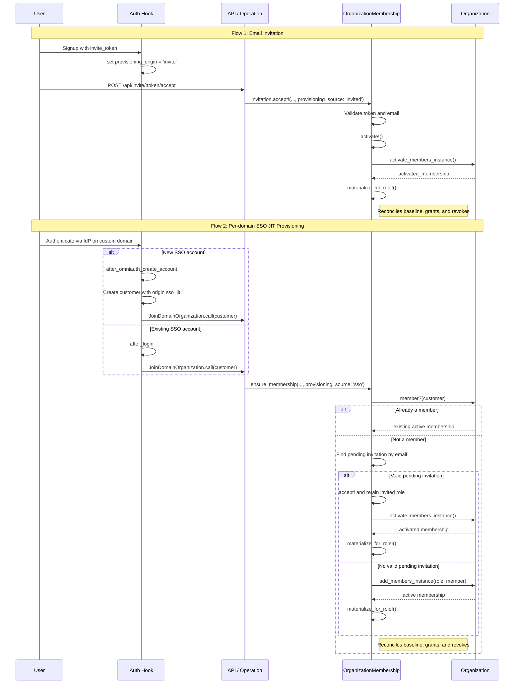

# Organization Membership Entitlements

This document describes how organization membership entitlements are materialized in Onetime Secret through email invitations and per-domain SSO JIT provisioning.

Per-domain SSO requires `ORGS_SSO_ENABLED=true`. `ENABLE_ORGS=true` is independent: it exposes the organization switcher UI so users can view and switch between organizations. Organizations exist for billing regardless of that UI flag, and it is not a prerequisite for membership materialization or per-domain SSO.

## Overview

Organization membership entitlements dictate what actions a user can perform within a specific organization context.

When a user joins an organization, the membership entitlement baseline is the intersection of the organization's effective entitlements and the user's role constraints (`ROLE_ENTITLEMENTS[role]`). This baseline ensures a membership never exceeds the organization's available entitlements, while role templates restrict which of those entitlements the specific role permits.

The membership's effective entitlements are then reconciled as `(baseline ∪ entitlements_grants) − entitlements_revokes`. Membership-level grants add entitlements beyond the baseline, and membership-level revokes remove entitlements from either the baseline or grants.

Regardless of how a user joins (via an email invite or JIT SSO provisioning), both codepaths converge on the `OrganizationMembership` model and call `materialize_for_role!` to persistently materialize entitlements.

## Provisioning Codepaths

### 1. Email Invitation (`invite`)

When a user clicks an invite link and signs up or logs in, the flow is:

1. **Signup/Login Hook:** `apps/web/auth/config/hooks/account.rb` sets the customer's `provisioning_origin = 'invite'` and auto-verifies the account since they own the email address.
2. **Acceptance API:** The frontend makes a POST request to `/api/invite/:token/accept`, which invokes `InviteAPI::Logic::Invites::AcceptInvite`.
3. **Invitation Acceptance:** The logic calls `invitation.accept!(customer, provisioning_source: 'invited')`.
4. **Activation & Materialization:** Inside `OrganizationMembership#accept!`, the system validates the email, consumes the token, and calls `activate!`. This creates the active membership (via `organization.activate_members_instance`) and immediately calls `activated.materialize_for_role!` to persist the role-scoped entitlements in Redis.

### 2. JIT SSO Provisioning (`sso_jit`)

Per-domain SSO JIT provisioning requires `ORGS_SSO_ENABLED=true`. When a user authenticates with an Identity Provider on a custom domain, the flow is:

1. **New-account hook:** For a new SSO account, `after_omniauth_create_account` in `apps/web/auth/config/hooks/omniauth.rb` creates the customer with `provisioning_origin: 'sso_jit'`, then invokes `Auth::Operations::JoinDomainOrganization#call` for the validated domain.
2. **Existing-account hook:** For an existing SSO account, `after_login` in `apps/web/auth/config/hooks/login.rb` invokes `JoinDomainOrganization#call` after consuming the validated domain ID. It does not create a new customer or restamp `provisioning_origin`.
3. **Ensure Membership:** The operation calls `Onetime::OrganizationMembership.ensure_membership(..., provisioning_source: 'sso')`.
4. **Existing or pending membership:** An existing active membership is returned unchanged. If a valid pending invitation exists for the authenticated email, `ensure_membership` activates that invitation and retains its invited role rather than substituting the SSO default role. Activation materializes the role baseline and reconciles membership grants and revokes.
5. **Direct addition:** Without a valid pending invitation, `ensure_membership` directly creates an active `member` membership via `organization.add_members_instance` and immediately invokes `membership.materialize_for_role!`. Expired or otherwise stale pending invitations are cleaned up before this direct-add path.

## Architecture

