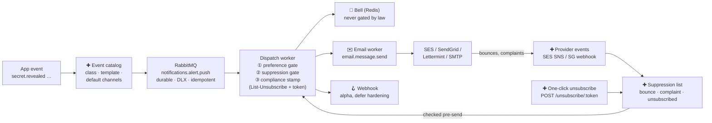

# Notifications — the 20% that does 80% (design brief)

## Provenance

Prepared 2026-08-16 as a problem-space brief, before discovering the
`docs/specs/email-quality-controls/` epic. Where the two conflict on email
compliance mechanics (notably: suppression storage — this brief proposed
Postgres; the epic and shipped code use Redis/Familia), **the epic slices are
authoritative**. This brief remains the broader map: event taxonomy, channels
beyond email, and preference design. Execution status lives in
[`../email-quality-controls/01-mvp-roadmap-and-workflow.md`](../email-quality-controls/01-mvp-roadmap-and-workflow.md).

Thesis: the effort pays off not in new channels or new events, but in making
the send path that already exists lawful, suppressible, and preference-aware.
Grounded in a survey of the codebase.

## 01 — You're further along than you think

Current state, from the code:

**Have**

- **Unified mailer + 4 providers** — `Onetime::Mail::Mailer` with SES,
  SendGrid, Lettermint, SMTP backends, per-domain sender identities, and
  transient-aware `DeliveryError`.
- **Durable queue topology** — `email.message.send`,
  `notifications.alert.push`, DLX/DLQ per queue, idempotency claims, schema
  versioning, graceful fallbacks when RabbitMQ is down.
- **A dispatch abstraction** — `DispatchNotification` already fans out to
  bell / email / webhook per message. This is the seam everything below plugs
  into.
- **~20 email templates** — MFA changed, new-login alert, payment failed, org
  lifecycle… written, though not all reachable from every call site.

**Partial**

- **Webhook channel (alpha)** — inline HTTP POST with SSRF guards, but no
  signing, no rate limit — and `webhooks.payload.deliver` is declared with
  **no consumer**.
- **One preference flag** — `notify_on_reveal`, a boolean on Customer, with a
  Vue settings page and API endpoint already wired. Extensible by design.

**Gap**

- **No suppression list** — bounces and complaints go nowhere; a dead address
  gets mailed forever. *(Since superseded: a Redis suppression model shipped —
  see Provenance.)*
- **No unsubscribe** — no `List-Unsubscribe` headers, no one-click endpoint,
  no footer link. This is the compliance exposure.
- **No event vocabulary** — events are ad-hoc strings (`secret.viewed`…) with
  no registry mapping event → class → template → default channels.

## 02 — The Pareto cut

Estimated value delivered vs. build effort, per capability:

| Capability | Value | Effort |
|---|---|---|
| Suppression list | █████████▌ 95% | tiny |
| One-click unsubscribe | █████████ 90% | small |
| Event catalog (registry) | ████████ 80% | small |
| Category preferences | ███████ 70% | small |
| Register orphan templates | ██████ 60% | trivial |
| Provider event webhooks | █████▌ 55% | medium |
| Digest / batching | ██▌ 25% | large |
| Hardened webhooks (signing) | ██ 22% | medium |
| In-app notification model | █▌ 18% | medium |
| Slack / SMS / push channels | █ 10% | large |

The top six are the 20%. They're all small because the queue, worker, mailer,
and dispatch seam already exist — each one is a check or a table, not a
system.

## 03 — One pipeline, three gates

Target send path (new pieces marked ✚):



## 04 — Event classes, not events

The classification does the compliance work — individual events slot in later.

| Class | Examples (templates exist) | Unsubscribable? | Suppression applies? | Default channels |
|---|---|---|---|---|
| **Transactional** — user asked for this exact email | verify account, password reset, magic link, secret link, invite | No — the product breaks without it | Hard bounce only | email |
| **Security** — something happened to your account | new-login alert, MFA enabled/disabled, password changed, secret revealed/burned | Per category — but strongly default-on | Bounce + complaint | bell + email |
| **Account & billing** | payment failed, trial expiring, subscription changed, role changed, expiration warning | Per category | Bounce + complaint | bell + email |
| **Product / marketing** | feature announcements, tips *(none exist today — good)* | Yes — opt-in, one-click required | Everything + unsubscribed | email |

Four rows of policy cover every future event. When someone proposes a new
notification, the only question is "which row?" — the row answers headers,
suppression, and preferences automatically.

## 05 — Compliance floor

What Gmail/Yahoo bulk-sender rules, RFC 8058, and CAN-SPAM/CASL/GDPR actually
require:

| Requirement | Rule / source | What it means here | Status |
|---|---|---|---|
| List-Unsubscribe header | RFC 2369 · Gmail/Yahoo mandate | Stamp `mailto:` + HTTPS URL on every non-transactional email, in the mailer layer so no template can forget it | Missing |
| One-click (POST) | RFC 8058 · Gmail/Yahoo mandate | `List-Unsubscribe-Post: List-Unsubscribe=One-Click`; endpoint takes signed token, no login, no confirmation page, POST-only (link scanners issue GETs) | Missing |
| Honor within 2 days | RFC 8058 / Gmail | Trivial if unsubscribe writes straight to the suppression/preference store — honor it in seconds, not days | Missing |
| Bounce handling | Deliverability, provider ToS | Hard bounce → suppress address globally. Providers throttle or ban senders who keep mailing dead addresses | Missing |
| Complaint handling | Gmail <0.3% spam-rate rule | FBL complaint → suppress from all non-transactional mail immediately | Missing |
| Footer unsubscribe link | CAN-SPAM · CASL · GDPR/ePrivacy | Visible link in the shared email layout (one file: `layout.html.erb`) + physical address for marketing class | Missing |
| SPF / DKIM / DMARC | Gmail/Yahoo mandate | Provider-side; per-domain sender strategies already manage identities — verify DMARC alignment per custom domain | Verify |
| Transactional exemption | All of the above | Password resets, secret links, receipts are exempt from unsubscribe — *but only if you classify them*; the event catalog is what makes the exemption defensible | Needs catalog |

## 06 — Two small stores

*(Superseded on the suppression side — see Provenance. Kept as originally
drafted.)*

Suppression is global truth → PostgreSQL/Rodauth side; preferences are
per-customer → Redis, pattern exists.

**New · postgres — `email_suppressions`**

```
email       citext, indexed
reason      ∈ hard_bounce · complaint · unsubscribed_all · manual
source      ∈ ses · sendgrid · one_click · admin
scope       ∈ all · marketing
created_at · expires_at (soft bounces only)
```

Lives next to Rodauth in Postgres because it must survive Redis flushes, apply
to *addresses* (including non-customers who receive secret links), and be
auditable. One indexed lookup in the dispatch worker.

**Extend · redis — Customer notification prefs**

```
hashkey :notification_prefs
  security.email    = true
  account.email     = true
  marketing.email   = false   # opt-in
  secret_activity.* = notify_on_reveal (migrated)
```

Category × channel, not per-event — four toggles, not forty.
`UpdateNotificationPreference` and `NotificationSettings.vue` already exist;
extend `VALID_FIELDS` and reuse the page.

## 07 — Sequence

Each phase is independently shippable; 1–3 are the Pareto core.

**Phase 1 · compliance floor — suppression + one-click unsubscribe**

- `email_suppressions` store + check in `EmailWorker`/dispatch before every
  send — result: `:suppressed`, not `:error`
- Signed unsubscribe tokens (HMAC of email + category, no DB row per token).
  The token carries an expiry and a random nonce so a leaked token (email
  forward, log line, header capture) cannot be replayed indefinitely, and the
  endpoint only accepts categories in the unsubscribable set — never
  `transactional` or `security` class (§04). The one write it performs is a
  scoped suppression row, so the effect is idempotent within the token's
  window. `POST /unsubscribe/:token` endpoint
- Stamp `List-Unsubscribe` / `List-Unsubscribe-Post` headers centrally in
  `Mailer.deliver`; footer link in the shared layout

**Phase 2 · event catalog — registry: event → class → template → channels**

- One Ruby hash/YAML mapping each event to its class from §04 — replaces
  ad-hoc type strings
- Register any orphan templates (new-login alert, MFA changed, payment
  failed…) — instant feature wins, near-zero cost
- Dispatch worker resolves channels + gates from the catalog instead of the
  message payload

**Phase 3 · preferences + feedback loop — category prefs · provider event
ingestion**

- Extend prefs to category × channel; migrate `notify_on_reveal` into it
- SES → SNS → HTTPS endpoint (and SendGrid event webhook) → publish to a
  queue → write suppressions — reuses the Stripe-webhook-to-queue pattern
  already in production

**Later · deliberately deferred — the other 80% of effort**

- Webhook hardening (signing, allowlists) + consuming
  `webhooks.payload.deliver`
- Bell notifications as a real Familia model with read-state;
  digests/batching; Slack/SMS/push; per-event granularity

---

Survey basis: `lib/onetime/mail/*`, `lib/onetime/jobs/*` (publisher, queue
config, workers, scheduled), `lib/onetime/operations/dispatch_notification.rb`,
`apps/web/auth/config/*` (Rodauth features + email hooks), `Onetime::Customer`,
`UpdateNotificationPreference`. Effort labels are relative to this codebase,
where queueing, retry, DLQ, and template plumbing already exist.
