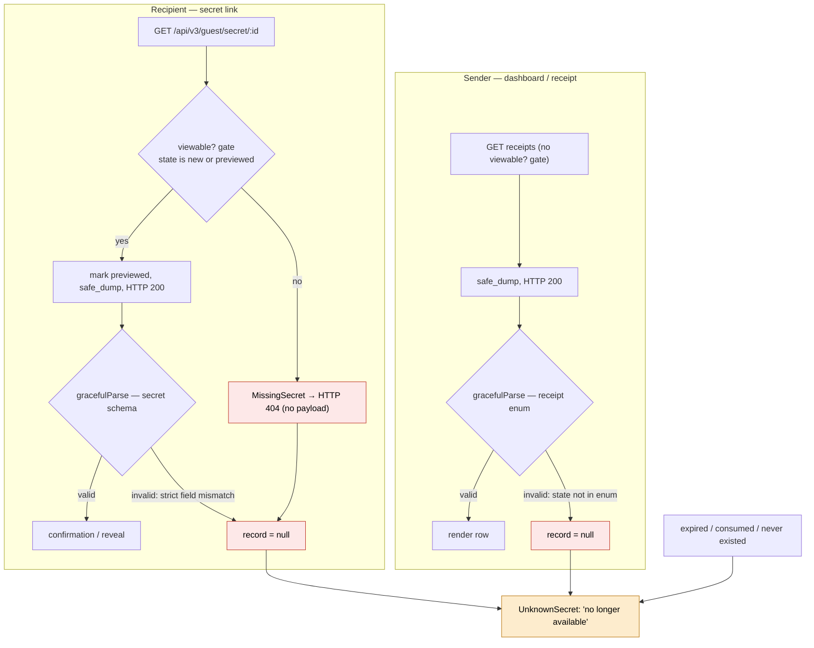

# Schema as Single Source of Truth + Boundary Validation

Design spec for [#3496](https://github.com/onetimesecret/onetimesecret/issues/3496).
Resolves the [#3424](https://github.com/onetimesecret/onetimesecret/issues/3424)
class of failures: a secret renders "That information is no longer available"
while it is neither expired nor consumed.

Status: accepted. Amended 2026-07-06: the target architecture and Phases 1–3
are revised in place per corrections Δ1–Δ4 in
[schema-target-architecture.md](./schema-target-architecture.md), which holds
the rationale and evidence; executable proofs (P1–P6) in
[proofs/emission_boundary_proof.rb](./proofs/emission_boundary_proof.rb).

## Behavior

A user reaches a secret through two independent paths, each with its own
acceptance gate for `state`. A value outside a gate's accepted set fails that
path, and every failure — together with legitimate expiry — renders the same
screen, so the cause is not visible.

**Recipient (secret link).** `GET /api/v3/guest/secret/:id` applies the
`viewable?` gate before serializing: content present **and** `state ∈ {new,
previewed}`. Any other value raises `MissingSecret` → HTTP 404 with no payload
(consumed states `revealed`/`burned` 404 here too, correctly). A viewable secret
is marked previewed, serialized via `safe_dump`, and returned 200; the frontend
then validates it against the secret schema.

**Sender (dashboard / receipt).** Receipt fetches have no `viewable?` gate and
always return 200. Acceptance is the frontend receipt enum (`new, shared,
revealed, burned, previewed, expired, orphaned`); a `state` outside it fails
`gracefulParse`.

Numeric and timestamp fields are coerced to their wire types at the `safe_dump`
boundary (`to_i`/`to_f`) and cannot fail validation. `state` is emitted raw with
no coercion and can.

The recipient 404, the sender parse failure, and the legitimate gone-states all
converge on `record == null` → the `UnknownSecret` screen. The three conditions
are indistinguishable to the user and emit no operator signal.



Open: what gives a production record a `state` outside the accepted set.
Resolved by `HGET secret:<id>:object state` / `HGET receipt:<id>:object state` on
a failing record.

## Root causes

1. Familia storage is type-preserving, not type-enforcing: `field` values
   round-trip as whatever Ruby type/bytes were written, with no `type:`/coerce
   option. Wrong-typed or out-of-enum values persist and resurface unchanged.
2. The contract is a strict, all-or-nothing gate: one unaccepted field nulls the
   entire record.
3. Coercion is per-field and manual in `safe_dump`; `state` is unguarded. There is
   no systematic, contract-driven coercion.
4. Validation failures are unobservable: `gracefulParse` keeps only a generic
   message and routes the failing path to Sentry extras
   (`src/utils/schemaValidation.ts`, `src/services/diagnostics.service.ts`).
5. The failure surface is ambiguous: 404, parse failure, and legitimate expiry
   render identically (`BaseShowSecret.vue` → `UnknownSecret.vue`).

## Target architecture

One authority per projection; machine bridges between them; nothing is
hand-aligned. (Amended per Δ1/Δ2/Δ4 — the original single-source claim, with
storage schemas derived from TS contracts, does not survive the field sets;
see schema-target-architecture.md.)

```
src/schemas/contracts/*.ts ── canonical WIRE model (Zod, no transforms)  ◄── wire + application authority
   └─► generated/schemas/shapes/*  (wire projection, per API version; checked in, CI drift gate)
          → backend validates the FINAL endpoint payload  (pre-response, otto response_data seam)
          → frontend gracefulParse                         (already)

lib/onetime/models/<model>/storage.schema.json  ◄── storage authority (Ruby-authored, co-located)
   └─► Familia feature :schema_validation validates to_h  (pre-save; explicit Familia.schemas keys)
```

The unit of wire validation is the final endpoint payload — `safe_dump` output
merged with the logic-class computed attributes — not raw `safe_dump`: a bare
`safe_dump` record fails the shape schema on its required merged fields
(proof P2). Registries stay split by projection: Familia's `SchemaRegistry`
holds storage schemas (class-name keys); an OTS `WireSchemas` registry holds
endpoint payload schemas (registry keys). Drift between model, storage, and
wire becomes a build failure, not a production incident.

## Phases

**0 — Observability.** Include the Zod issue path in the `gracefulParse` log
message and as a searchable Sentry tag (`schemaField` in
`diagnostics.service.ts` `TAG_FIELDS`); log on backend shape-validation failure.

**1 — Storage schemas (amended, Δ1).** Hand-author one JSON Schema per model,
co-located with it (`lib/onetime/models/receipt/storage.schema.json`),
describing the canonical at-rest shape: every persistent field, its type,
`state` as the canonical enum, `null` wherever unset is legal. Deriving these
from TS contracts is unsound — the field sets differ in both directions
(storage-only fields the contract has never heard of; wire-only computed
fields never stored). A short spec asserts schema properties ==
`Model.persistent_fields` (modulo declared exclusions) to prevent drift
against the field declarations.

**2 — Boundary validation (amended, Δ2/Δ4).** Storage: wire the co-located
schemas via explicit `Familia.schemas` in `lib/onetime/boot.rb` (the
convention loader cannot produce namespaced class names) and enable
`feature :schema_validation` on `OT::Secret` and `OT::Receipt`; validate
`to_h` pre-save (warn, then raise after Phase 4). Inject a memoizing
validator via `Familia.schema_validator` — the default recompiles the schema
on every call (proof P5). Wire: validate the final endpoint payload — not
raw `safe_dump` (proof P2) — against the shape schema at otto's
`JSONHandler` → `logic#response_data` seam (currently unclaimed;
`V3::Logic::Base#success_data` is dead code, removed when claiming it),
keyed by each logic class's `SCHEMAS[:response]` through the OTS
`WireSchemas` registry. Production posture: pre-save raises once clean;
emission logs + metrics, permanently.

**3 — Schema-driven coercion (amended, Δ3).** Replace hand-written
`safe_dump` casts with a coercion layer driven by the wire schema plus the
rename registry (`src/schemas/renames.json`) — not "the schema" in the
abstract — and keep it separate from computed-field lambdas rather than
replacing `safe_dump` wholesale. Normalize `state`: registry renames
(`viewed→previewed`, `received→revealed`) to canonical; unrecognized values
to a logged fallback.

**4 — Reconcile keyspace.** Migrate at-rest `state` values to canonical for
`secret:*` and `receipt:*`. Extend the diagnostic to report any field outside its
schema, not only numerics. Flip Phase 2 to raise once clean.

**5 — Resilient consumer.** On parse failure, salvage per-field rather than
nulling the record; `UnknownSecret` distinguishes expiry/404 from a validation
error. CI: schema-sync check and contract tests over out-of-enum/legacy
`state` fixtures.

MVP closing #3424: Phases 0, 2 (pre-response), 3 (`state`), 4.

## Alternatives

- **A. Per-field casting as fields surface (status quo).** Incomplete by
  construction; `state` is the next unguarded field. → root cause 3.
- **B. Loosen the contract (coerce/nullable everywhere).** Abandons the type
  guarantee and hides corruption; kept only as the Phase 5 salvage.
- **C. Typed fields in Familia (`field :x, type: Integer`).** Correct at the
  source but needs an upstream gem change; Phase 3 is the same idea where we
  control it. → root cause 1.
- **D. Write-boundary coercion only (#3299 `spawn_pair`).** Cannot heal existing
  data; misses non-`spawn_pair` writers and wire-shape drift.
- **E. Validate `to_h` only (#3496 as written).** `safe_dump ≠ to_h`; the wire
  payload can still fail. Both boundaries required.
- **F. Server-side render to bypass the SPA schema.** Large change, discards the
  type guarantee, ignores the sender path.
- **G. Observability only.** Identifies the field, not the recurrence; it is
  Phase 0, not the cure.
- **H. Replace the datastore.** Redis/Dragonfly/Valkey/KeyDB preserve hash bytes
  and reply types identically; not a variable.

## Acceptance

1. A validation failure reports the field path in logs and as a searchable tag.
2. An out-of-enum `state` record is flagged by the diagnostic, normalized so the
   wire payload validates, and rewritten by the migration.
3. Representative recipient and sender payloads, including out-of-enum fixtures,
   pass the generated schemas in CI.
4. Removing any interim `to_i`/`to_f` cast leaves output unchanged.
5. A viewable secret renders even if a non-essential field is malformed; expiry
   and validation errors are distinguishable in the UI.

## References

- Amendments: `docs/specs/schemata/schema-target-architecture.md` (Δ1–Δ4
  rationale and evidence),
  `docs/specs/schemata/proofs/emission_boundary_proof.rb` (P1–P6).
- Emission seam: otto 2.5.0 `lib/otto/response_handlers/json.rb`
  (`JSONHandler` prefers `logic#response_data`).
- Issues/PRs: #3424, #3496; prior numeric coercion #3268, #3299, #3434, #3477.
- Backend: `lib/onetime/models/secret/features/safe_dump_fields.rb`,
  `lib/onetime/models/receipt/features/safe_dump_fields.rb`,
  `lib/onetime/models/secret/features/secret_state_management.rb`,
  `apps/api/v2/logic/secrets/show_secret.rb`, `apps/api/v3/logic/secrets.rb`,
  `lib/onetime/boot.rb`.
- Frontend: `src/schemas/contracts/{secret,receipt}.ts`,
  `src/schemas/shapes/v3/{secret,receipt}.ts`, `src/schemas/api/base.ts`,
  `src/shared/stores/secretStore.ts`, `src/utils/schemaValidation.ts`,
  `src/services/diagnostics.service.ts`,
  `src/shared/components/base/BaseShowSecret.vue`,
  `src/apps/secret/reveal/UnknownSecret.vue`.
- Generation: `src/schemas/scripts/generate.ts`, `src/schemas/registry.ts`,
  `generated/schemas/`.
- Familia: `lib/familia/horreum/serialization.rb`,
  `lib/familia/features/safe_dump.rb`,
  `lib/familia/features/schema_validation.rb`,
  `lib/familia/schema_registry.rb`.
