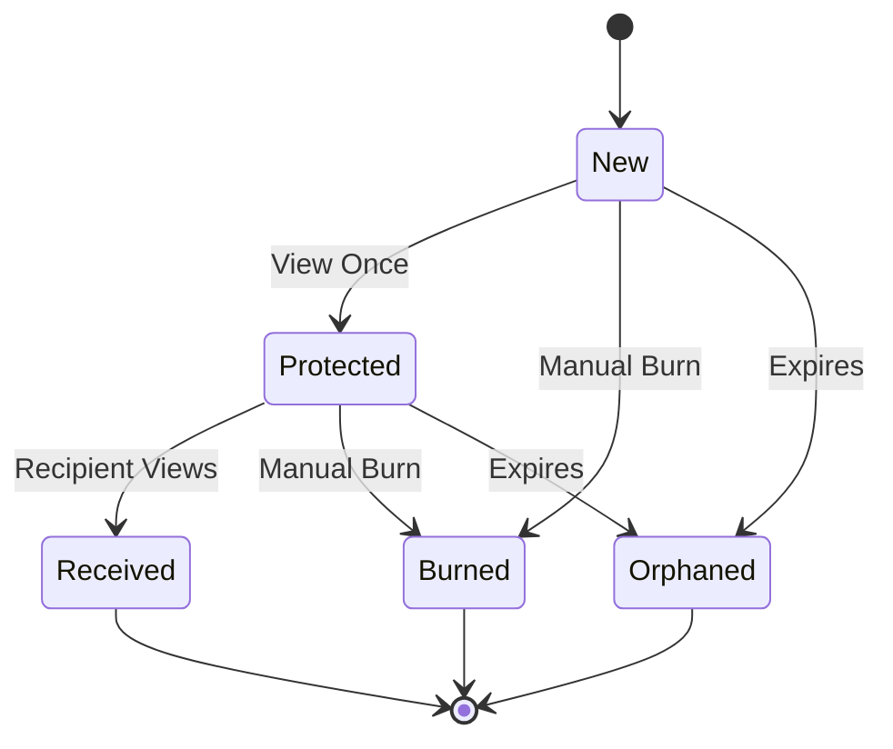

# Views - Secrets

Secrets have a shadow self called metadata. The metadata page is
the primary view for secrets for the person who created it. It is
completely separate from the secret page which the recipient sees.
The Vue component views in this directory are responsible for
rendering both pages.

## Metadata Page

`secrets.example.com/receipt/METADATA_KEY`

The metadata page has distinct states with specific visual priorities
and transitions, primarily based on the parameters and state of the
secret.

1. Viewable (Initial State - New)
   - Emerald color scheme
   - Shows absolute URL to the secret link
   - Shows actual secret content (unless the secret is protected by passphrase)
   - Displays "New secret created successfully!"
   - Emphasizes "you will only see this once"
   - Prominently shows expiration timing

2. Protected (After it's been viewed once)
   - Amber color scheme
   - Hides secret content with bullet points
   - Hides URL to the secret link (unless the user is the owner of the metadata/secret)
   - Shows "Encrypted" status OR "Encrypted with passphrase"
   - Maintains expiration timing display

3. Received (After Recipient Receives the secret content)
   - Gray color scheme
   - Shows "Received X time ago" message
   - Secret content is permanently removed (it is literally deleted from the database and not recoverable)
   - Keeps creation/received timestamps

4. Burned (Manual Destruction)
   - Red color scheme
   - Shows "Burned X time ago" message
   - Secret content is permanently removed
   - Hides all "Encrypted" status text
   - Maintains burn timestamp

5. Destroyed (Terminal State)
   - Red color scheme
   - Combines received/burned/orphan states
   - Shows appropriate timing information based on update timestamp
   - No access to secret content

Each state transition is one-way and permanent, with visual elements
like (icons, colors, messages) carefully designed to communicate the
secret's current status and history.

## Secret Page

`secrets.example.com/secret/SECRET_KEY`
